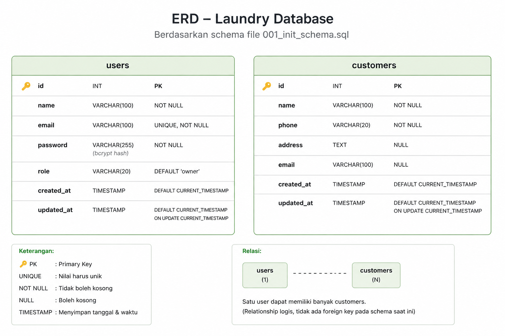

# Laundry Achul - Backend API


## 📋 Deskripsi

**Laundry Achul Backend** adalah REST API untuk aplikasi manajemen laundry yang dibangun dengan **Golang + Gin Framework + MySQL**. API menyediakan fitur autentikasi JWT, CRUD pelanggan, dan dokumentasi Swagger.

> ⚠️ **CATATAN:** Backend ini dikembangkan dalam waktu **singkat (~2.5 jam)** sebagai bagian dari **Tes Magang - Intern Developer** di **PT. Piposmart Digital Indonesia**. Fokus pada fungsionalitas dasar dan demonstrasi kemampuan teknis.

---

## 🎯 Fitur

✅ **Autentikasi JWT**
- Login dengan email & password
- Password hashing dengan bcrypt
- Token expire 24 jam
- Protected endpoints dengan middleware JWT

✅ **CRUD Pelanggan**
- Get all customers
- Get customer by ID
- Add new customer (POST)
- Update customer (PUT)
- Delete customer (DELETE)

✅ **API Documentation**
- Swagger UI interactive
- Full endpoint documentation
- Try-it-out feature

✅ **Error Handling**
- Standardized JSON response
- Proper HTTP status codes
- Input validation

---

## 🛠️ Tech Stack

| Komponen | Teknologi |
|----------|-----------|
| **Language** | Go 1.21+ |
| **Web Framework** | Gin |
| **Database** | MySQL 8.0+ |
| **ORM** | GORM |
| **Authentication** | JWT (golang-jwt) |
| **Password Hashing** | bcrypt |
| **API Documentation** | Swagger/OpenAPI (swaggo) |

---

## 📦 Dependencies

```
github.com/gin-gonic/gin          - Web framework
gorm.io/gorm                       - ORM
gorm.io/driver/mysql              - MySQL driver
github.com/golang-jwt/jwt/v5      - JWT
golang.org/x/crypto/bcrypt        - Password hashing
github.com/gin-contrib/cors       - CORS support
github.com/swaggo/gin-swagger     - Swagger UI
github.com/joho/godotenv          - .env support
```

---

## 🚀 Setup & Instalasi

### Prerequisites
- **Go** 1.21 atau lebih baru
- **MySQL** 8.0 atau lebih baru
- **Postman** atau **curl** (untuk testing)

### Langkah-Langkah

#### 1. Clone Repository
```bash
cd C:\dev
git clone <repository-url>
cd laundryachul-backend
```

#### 2. Install Dependencies
```bash
go mod download
# atau
go get ./...
```

#### 3. Setup Database

**Buat database baru:**
```sql
CREATE DATABASE laundry_db CHARACTER SET utf8mb4 COLLATE utf8mb4_unicode_ci;
```

**Update MySQL credentials di `main.go` baris DSN (jika berbeda):**
```go
dsn := "root:YOUR_PASSWORD@tcp(127.0.0.1:3306)/laundry_db?charset=utf8mb4&parseTime=True&loc=Local"
```

Sesuaikan:
- `root` → username MySQL kamu
- `YOUR_PASSWORD` → password MySQL kamu
- `localhost:3306` → host & port MySQL kamu

#### 4. Generate Swagger Documentation
```bash
swag init
```

Ini generate folder `docs/` dengan `swagger.json` & `swagger.yaml`.

#### 5. Jalankan Server
```bash
go run main.go
```

Output:

```
[GIN-debug] Listening and serving HTTP on :8080
```

Server berjalan di `http://localhost:8080`

---

## 📚 API Endpoints

### Base URL

http://localhost:8080/api

### Authentication Endpoints

#### **Login** (public)

```
POST /login
Content-Type: application/json
{
"email": "admin@laundry.com",
"password": "password"
}
Response (200):
{
"success": true,
"message": "Login berhasil",
"data": {
"token": "eyJhbGc...",
"user": {
"id": 1,
"name": "Mario Wicaksono",
"email": "admin@laundry.com",
"role": "Owner"
}
}
}
```

#### **Logout** (requires JWT)

```
POST /logout
Authorization: Bearer <TOKEN>
Response (200):
{
"success": true,
"message": "Logout berhasil",
"data": {}
}
```

---

### Customer Endpoints (semua require JWT)

#### **Get All Customers**

```
GET /customers
Authorization: Bearer <TOKEN>
Response (200):
{
"success": true,
"message": "Berhasil mengambil data",
"data": {
"customers": [...],
"total": 3
}
}
```

#### **Get Customer Detail**

```
GET /customers/:id
Authorization: Bearer <TOKEN>
Response (200):
{
"success": true,
"message": "Berhasil mengambil detail",
"data": {
"id": 1,
"name": "Budi Santoso",
"phone": "081234567890",
"address": "Jl. Merdeka No. 10",
"email": "budi@email.com",
"created_at": "2026-07-06T10:30:00Z"
}
}
```

#### **Add Customer**

```
POST /customers
Authorization: Bearer <TOKEN>
Content-Type: application/json
{
"name": "Joko Widodo",
"phone": "089876543210",
"address": "Jl. Sudirman",
"email": "joko@email.com"
}
Response (201):
{
"success": true,
"message": "Pelanggan berhasil ditambahkan",
"data": {...}
}
```

#### **Update Customer**

```
PUT /customers/:id
Authorization: Bearer <TOKEN>
Content-Type: application/json
{
"name": "Joko Updated",
"phone": "089876543211",
"address": "Jl. Sudirman Baru",
"email": "joko.updated@email.com"
}
Response (200):
{
"success": true,
"message": "Pelanggan berhasil diperbarui",
"data": {...}
```

#### **Delete Customer**

```
DELETE /customers/:id
Authorization: Bearer <TOKEN>
Response (200):
{
"success": true,
"message": "Pelanggan berhasil dihapus",
"data": {}
}
```

---

## 🔐 Default Credentials (untuk testing)

Email:    admin@laundry.com
Password: password

Data dummy (3 customers) otomatis di-seed saat startup.

---

## 📖 Swagger Documentation

Akses dokumentasi API interaktif di browser:

http://localhost:8080/swagger/index.html

Di sini kamu bisa:
- Melihat semua endpoint dengan detail
- Lihat request/response format
- **Try it out** - langsung test endpoint dari UI (butuh token untuk protected endpoints)

---

## 🧪 Testing API

### Menggunakan Postman

1. **Import collection** (opsional):
   - Buka Postman → File → Import
   - Pilih `Laundry_API.postman_collection.json`

2. **Manual test:**

**Step 1: Login dulu**

POST http://localhost:8080/api/login
Body: {"email": "admin@laundry.com", "password": "password"}

Copy token dari response.

**Step 2: Gunakan token untuk endpoint lainnya**

GET http://localhost:8080/api/customers
Header: Authorization: Bearer <TOKEN_DARI_LOGIN>

### Menggunakan curl

```bash
# Login
curl -X POST http://localhost:8080/api/login \
  -H "Content-Type: application/json" \
  -d '{"email":"admin@laundry.com","password":"password"}'

# Copy token, terus:
# Get customers (ganti TOKEN_DARI_LOGIN dengan token yang didapat)
curl -X GET http://localhost:8080/api/customers \
  -H "Authorization: Bearer TOKEN_DARI_LOGIN"
```

---

## 📁 Project Structure

laundryachul-backend/
├── main.go                 # All-in-one: models, handlers, middleware, DB init
├── go.mod                  # Go module definition
├── go.sum                  # Dependency versions lock
├── docs/                   # Auto-generated Swagger docs
│   ├── swagger.json
│   ├── swagger.yaml
│   └── docs.go
└── README.md               # File ini

**Nota:** Karena timeline singkat (5 jam), struktur dijaga minimal — semua logic berada di `main.go`. Untuk production, refactor ke struktur layered (models/, handlers/, middleware/, utils/ folder terpisah).

---

## 🗺️ Entity Relationship Diagram (ERD)

<p align="center">
  
</p>

Diagram di atas menggambarkan struktur database yang digunakan pada aplikasi **Laundry Achul Backend**, yang terdiri dari tabel `users` dan `customers`.

## 🔄 Database Schema

### Table: `users`
```sql
CREATE TABLE users (
  id INT AUTO_INCREMENT PRIMARY KEY,
  email VARCHAR(100) UNIQUE NOT NULL,
  password VARCHAR(255) NOT NULL,
  name VARCHAR(100) NOT NULL,
  role VARCHAR(20) DEFAULT 'owner',
  created_at TIMESTAMP DEFAULT CURRENT_TIMESTAMP,
  updated_at TIMESTAMP DEFAULT CURRENT_TIMESTAMP ON UPDATE CURRENT_TIMESTAMP
);
```

### Table: `customers`
```sql
CREATE TABLE customers (
  id INT AUTO_INCREMENT PRIMARY KEY,
  name VARCHAR(100) NOT NULL,
  phone VARCHAR(20) NOT NULL,
  address TEXT,
  email VARCHAR(100),
  created_at TIMESTAMP DEFAULT CURRENT_TIMESTAMP,
  updated_at TIMESTAMP DEFAULT CURRENT_TIMESTAMP ON UPDATE CURRENT_TIMESTAMP
);
```

Dibuat otomatis saat startup via `DB.AutoMigrate()` di `main.go`.

---

## 🐛 Known Issues & Limitations

| Limitation | Alasan | Solusi (Future) |
|---|---|---|
| Logout tidak memblacklist token | Stateless JWT — no session storage | Implementasikan Redis token blacklist |
| Semua code di 1 file | Timeline 5 jam | Refactor ke clean architecture |
| No pagination di GET /customers | Simplicity | Tambah query param `?page=1&limit=10` |
| No search/filter | Simplicity | Tambah query param `?search=name` |
| No input sanitization | Basic validation saja | Use `github.com/go-playground/validator` |
| CORS hardcoded | Quick setup | Gunakan environment variables |

---

## 🚀 Future Improvements

- ✨ Refactor ke clean architecture (models/, handlers/, middleware/, repositories/, usecases/)
- ✨ Implementasi database migration tools (golang-migrate)
- ✨ Add pagination, search, advanced filtering
- ✨ Redis untuk token blacklist (proper logout)
- ✨ Unit testing & integration testing
- ✨ Docker & docker-compose setup
- ✨ CI/CD pipeline (GitHub Actions)
- ✨ Rate limiting & request throttling
- ✨ Enhanced logging (Zap/Logrus)
- ✨ Database indexes optimization

---

## 📞 Support & Notes

**Project untuk:** PT. Piposmart Digital Indonesia  
**Position:** Intern Developer Test  
**Timeline:** ~5 jam one-day sprint  
**Status:** ✅ MVP Complete

---

## 📝 Changelog

### v1.0.0 (2026-07-06)
- ✅ Initial backend setup
- ✅ JWT Authentication
- ✅ Customer CRUD API
- ✅ Swagger documentation
- ✅ MySQL integration
- ✅ Error handling & validation

---

**Happy Coding! 🚀**
